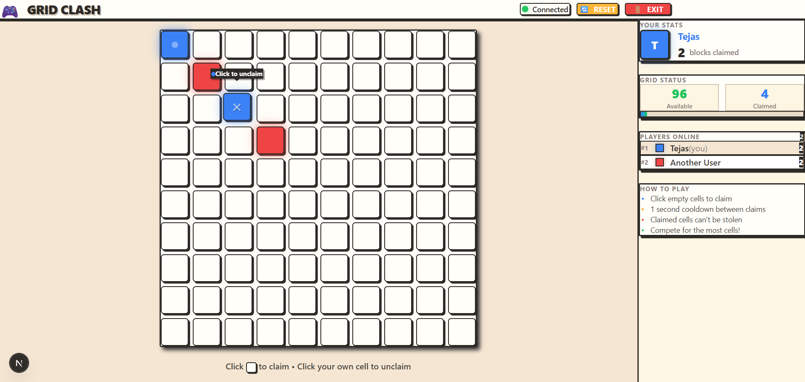

# 🎮 Grid Clash

A real-time multiplayer grid game where players compete to claim cells. Built with Next.js, Socket.io, and Redis.



## ✨ Features

- **Real-time Multiplayer**: See other players' moves instantly
- **Claim & Unclaim**: Toggle cells on/off with a simple click
- **Cooldown System**: 1-second cooldown between actions
- **Live Stats**: See online players and grid statistics
- **Responsive Design**: Works on desktop and mobile
- **Neo-Brutalist UI**: Clean, game-like aesthetic

## 🛠️ Tech Stack

### Frontend
- Next.js 16 (App Router)
- TypeScript
- Tailwind CSS v4
- Framer Motion
- Socket.io Client

### Backend
- Node.js + Express
- Socket.io
- Redis (Upstash)
- TypeScript

## 🚀 Getting Started

### Prerequisites
- Node.js 20+
- Redis instance (Upstash recommended)

### Installation

1. Clone the repository:
```bash
git clone https://github.com/tejasg99/grid-app.git
cd grid-app
```
2. Install dependencies:
```bash
npm install
```
3. Set up environment variables:
- Backend
```env
PORT=3001
REDIS_URL=your_upstash_redis_url
FRONTEND_URL=http://localhost:3000
NODE_ENV=development
```
- Frontend
```env
NEXT_PUBLIC_SOCKET_URL=http://localhost:3001
```
4. Start the development servers in respective directories
```bash
npm run dev
```

## Project Structure
```text
grid-app/
├── apps/
│   ├── web/          # Next.js frontend
│   │   ├── src/
│   │   │   ├── app/
│   │   │   ├── components/
│   │   │   ├── hooks/
│   │   │   └── lib/
│   │   └── ...
│   └── server/       # Express + Socket.io backend
│       └── src/
│           ├── config/
│           ├── services/
│           └── socket/
└── packages/
    └── shared/       # Shared TypeScript types
```

## How to Play
1. Enter your username to join the game
2. Click any empty cell to claim it
3. Click your own cell to unclaim it
4. Wait 1 second between actions (cooldown)
5. Compete to claim the most cells!

## Future Improvements
- Chat Integration
- Leaderboard
- Zoom/Pan across the grid